# AI-Trader Architecture Documentation

## System Overview

AI-Trader is a multi-agent autonomous trading system built on the **Model Context Protocol (MCP)**, enabling AI models to execute real trading operations through standardized tool interfaces.


---

## Component Architecture

### 1. AI Agent Layer

**Purpose:** Hosts multiple AI models that compete autonomously


**Key Features:**
- **Multi-Model Support:** GPT-4o, Claude, Qwen, DeepSeek, Gemini
- **Market Specialization:** Separate agent classes for US stocks, A-shares, crypto
- **Frequency Options:** Daily and hourly trading modes
- **Complete Autonomy:** Zero human intervention during trading sessions

**Design Patterns:**
- **Template Method:** Base class defines workflow, subclasses implement market-specific rules
- **Strategy Pattern:** Different trading strategies per market type
- **Factory Pattern:** Dynamic agent loading from configuration

---

### 2. MCP Toolchain Layer

**Purpose:** Expose trading capabilities as standardized MCP tools


**Tool Categories:**

| Category | Tools | Purpose |
|----------|-------|---------|
| **Trading** | `buy()`, `sell()`, `buy_crypto()`, `sell_crypto()` | Execute trades with market rules |
| **Price** | `get_price_local()` | Query historical prices |
| **Search** | `get_information()` | Market intelligence retrieval |
| **Math** | `calculate()` | Financial calculations |

**MCP Transport:**
- **Protocol:** HTTP (streamable-http)
- **Format:** JSON-RPC 2.0
- **Discovery:** Automatic tool listing via `/tools` endpoint

---

### 3. Security Layer

**Purpose:** Protect trading endpoints from unauthorized access


**Security Features:**

1. **API Key Authentication**
   ```python
   @require_mcp_auth
   def buy(symbol: str, amount: int, api_key: Optional[str] = None):
       # Trading logic here
   ```

2. **Constant-Time Comparison** (prevents timing attacks)
   ```python
   hmac.compare_digest(api_key, expected_key)
   ```

3. **Cross-Platform Locking** (prevents race conditions)
   ```python
   with _position_lock(signature):
       # Atomic read-modify-write
   ```

4. **Input Validation**
   - Symbol format validation
   - Amount range checking
   - Market rule enforcement

---

### 4. Data Flow Architecture


**Transaction Flow:**

1. **Initialization:**
   - Load `runtime_env.json` for current state
   - Read `position.jsonl` for latest position
   - Set `TODAY_DATE` for historical replay

2. **Tool Execution:**
   - AI agent requests tool call via LangChain
   - MCP adapter routes to appropriate service
   - Service validates and executes operation

3. **Persistence:**
   - Acquire cross-platform file lock
   - Append transaction to `position.jsonl`
   - Write AI reasoning to `log.jsonl`
   - Release lock

---

### 5. State Management

**Pattern:** File-based shared state with locking


**State Files:**

| File | Purpose | Access Pattern |
|------|---------|----------------|
| `runtime_env.json` | Shared configuration | Read/Write with lock |
| `position.jsonl` | Transaction log | Append-only with lock |
| `log.jsonl` | AI reasoning log | Append-only |
| `merged.jsonl` | Price data | Read-only |

**Concurrency Control:**
- **portalocker:** Cross-platform file locking (Windows/Unix/Linux)
- **Lock Scope:** Per-agent signature isolation
- **Lock Granularity:** Individual position updates
- **Timeout:** 30 seconds automatic release

---

### 6. Market Rules Engine

**Purpose:** Enforce market-specific trading rules

```mermaid
graph TB
    Input[Trade Request] --> Detect{Detect<br/>Market Type}

    Detect -->|.SH/.SZ| CN[Chinese A-Share]
    Detect -->|-USDT| Crypto[Cryptocurrency]
    Detect -->|Other| US[US Stock]

    CN --> CN1[100-share lot check]
    CN1 --> CN2[T+1 restriction check]
    CN2 --> CN3[Execute]

    Crypto --> Cry1[Decimal amount check]
    Cry1 --> Cry2[4-decimal precision]
    Cry2 --> Cry3[Execute]

    US --> US1[Integer amount check]
    US1 --> US2[Execute]

    style CN fill:#ff6b6b,stroke:#c92a2a
    style Crypto fill:#4ecdc4,stroke:#0ca678
    style US fill:#748ffc,stroke:#5c7cfa
```



**Market Rules Matrix:**

| Rule | US Stocks | Chinese A-Shares | Cryptocurrency |
|------|-----------|------------------|----------------|
| **Settlement** | T+0 | T+1 | T+0 |
| **Lot Size** | 1 share | 100 shares | 0.0001 units |
| **Amount Type** | Integer | Integer (×100) | Float (4 decimals) |
| **Trading Hours** | Market hours | Market hours | 24/7 |
| **Same-Day Sell** | ✅ Allowed | ❌ Prohibited | ✅ Allowed |

---

## Technology Stack

### Core Dependencies


---

## Deployment Architecture

### Development Environment


### Production Environment


---

## Extension Points

### Adding New Markets

```python
# 1. Create new agent class
class BaseAgentFX(BaseAgent):
    def __init__(self, **kwargs):
        super().__init__(**kwargs)
        self.market = "fx"

# 2. Register in main.py
AGENT_REGISTRY = {
    "BaseAgentFX": {
        "module": "agent.base_agent_fx.base_agent_fx",
        "class": "BaseAgentFX"
    }
}

# 3. Create trading tool
@mcp.tool()
def buy_forex(symbol: str, amount: float):
    # Forex-specific logic
    pass
```

### Adding New Tools

```python
# 1. Create new MCP server
mcp = FastMCP("MyCustomTools")

@mcp.tool()
def my_custom_tool(param: str) -> Dict[str, Any]:
    """Tool description"""
    return {"result": param}

# 2. Register in start_mcp_services.py
services = {
    "my_service": {"port": 8006, "module": "my_tool.py"}
}

# 3. Connect in agent config
{
    "tools": ["my_tool"]
}
```

---

## Performance Considerations

### Optimization Strategies

1. **File I/O:**
   - Append-only writes for position.jsonl
   - Cross-platform locking minimizes contention
   - Batch writes where possible

2. **Network:**
   - Connection pooling for API calls
   - Async I/O for concurrent requests
   - Request caching for price data

3. **Memory:**
   - Lazy loading of price data
   - Stream processing of large files
   - Periodic garbage collection

---

## Security Best Practices

1. **Authentication:**
   - Always set `MCP_API_KEY` in production
   - Use strong, randomly generated keys
   - Rotate keys regularly

2. **Data Validation:**
   - Validate all user inputs
   - Sanitize file paths
   - Check file permissions

3. **Error Handling:**
   - Never expose sensitive data in errors
   - Log security events
   - Graceful degradation

4. **Deployment:**
   - Use HTTPS in production
   - Restrict network access
   - Monitor for suspicious activity

---

## Troubleshooting

### Common Issues

| Issue | Symptom | Solution |
|-------|---------|----------|
| **Port Conflict** | "Address already in use" | Change port in `.env` or kill conflicting process |
| **Lock Timeout** | "Failed to acquire lock" | Check for stuck processes, clear `.position.lock` files |
| **Auth Failure** | "PermissionError" | Verify `MCP_API_KEY` matches in request |
| **Windows fcntl Error** | ModuleNotFoundError | Updated to use portalocker (v1.1.0+) |
| **Data Missing** | "Symbol not found" | Run data preparation scripts |

---

## Future Enhancements

- [ ] PostgreSQL for position storage (replacing file-based)
- [ ] Redis for distributed locking
- [ ] Message queue for async trade execution
- [ ] WebSocket for real-time price updates
- [ ] Kubernetes deployment support
- [ ] Multi-region data replication
- [ ] Advanced rate limiting
- [ ] Circuit breakers for API failures

---

## References

- [MCP Specification](https://modelcontextprotocol.io/)
- [LangChain Documentation](https://python.langchain.com/)
- [FastMCP Repository](https://github.com/jlowin/fastmcp)
- [Alpha Vantage API](https://www.alphavantage.co/)
- [Tushare Documentation](https://tushare.pro/)

---

**Document Version:** 1.1.0
**Last Updated:** 2025-01-21
**Maintainer:** AI-Trader Development Team
